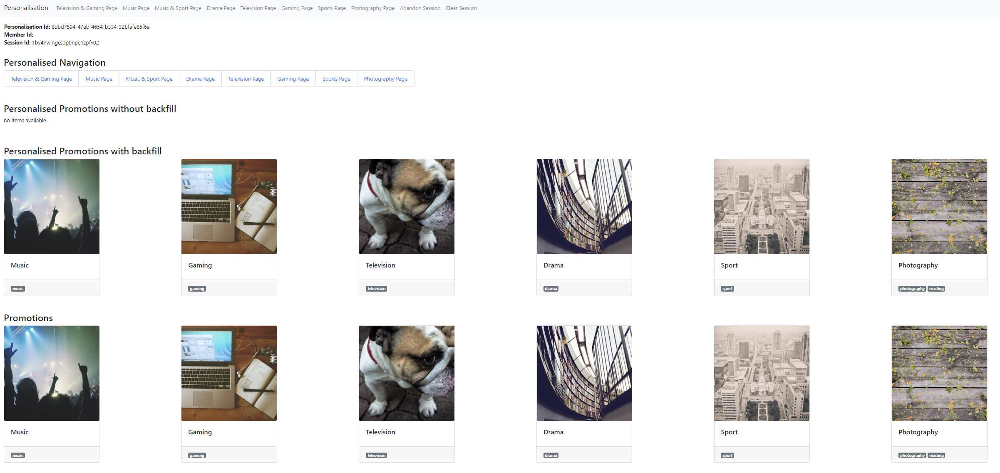
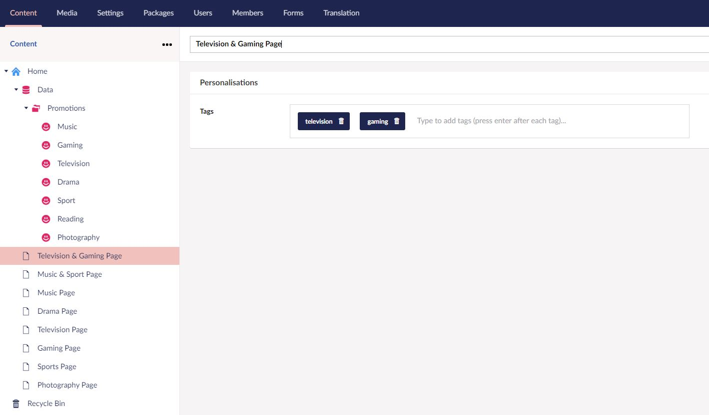
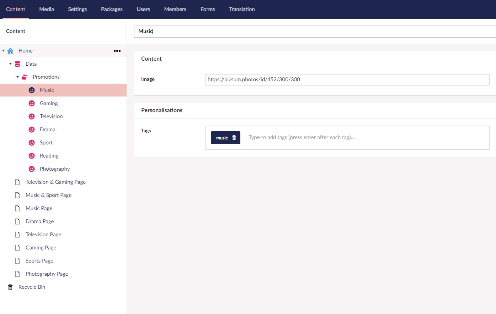
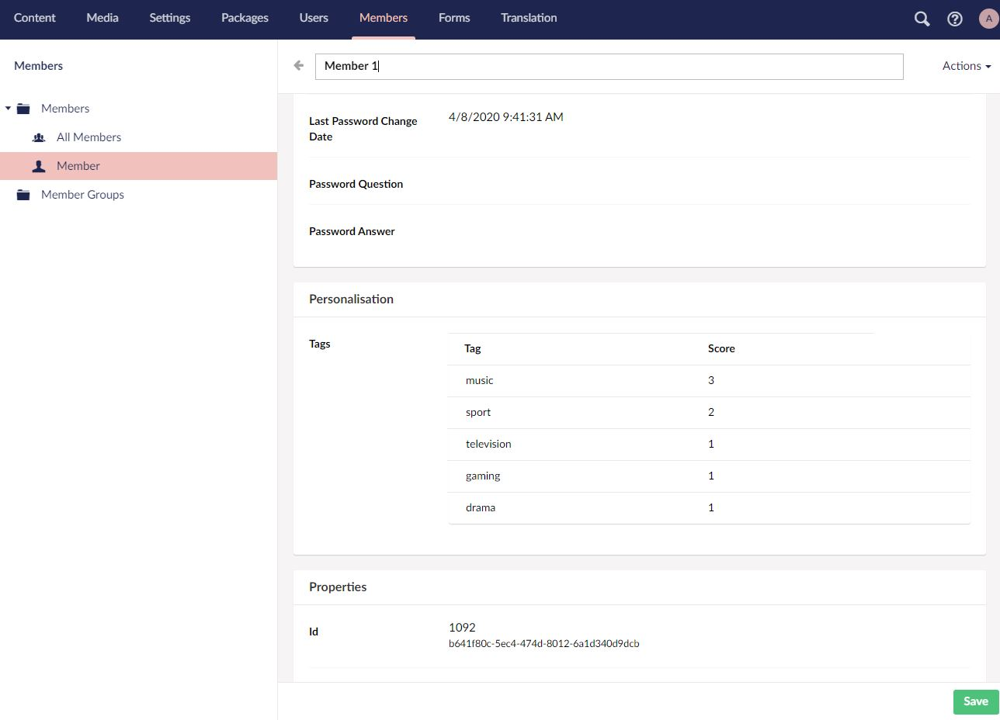

# Personalisation
At CarbonSixDigital we've developed a tag-based personalisation system for Members. It's simple to use and easy on your database. 

It works based on tags on pages and content and stores these against members efficently in session. Once the member has finished their journey, it stores them into your Umbraco database. 

Upon a repeat visit, the code pulls the member's persona from the database and back into session for efficent access. It then displays personalised content appropriately. 

# Nuget

`Install-Package CarbonSixDigital.Personalisation.Core`

There is a new website project in the solution with an example of how to use the nuget package. 

- Important, remember to change the global.asax to use the Personalisation.Core.Global to upsert to database on session end. 


# Screenshots

## Homepage

This shows examples of how content can be displayed to the member, including personalised navigation, promotions, promotions with backfilled content. 



## Page
This screenshot shows how easy it is to add tagging to a page to enable personalisation.


## Content
This screenshot shows how easy it is to add tagging to a content item to enable personalisation.


## Members
This screenshot shows what tags are part of this members persona. 


# Getting Started

Personalisation of content is easy with simple base controllers and methods: 

*Methods*
```csharp
viewModel.PersonalisedPromotions = Personalise(viewModel.Promotions, true);
viewModel.PersonalisedPromotionsWithoutBackfill = Personalise(viewModel.Promotions);
viewModel.Pages = Personalise(viewModel.MenuItems, true);
```

There is also a Global.cs file that sets the persona to the database upon session end.  

Please reference the controllers in the web project within the solution for an example of this. 

# Umbraco Version
- Umbraco 8.5.3 +

# Umbraco Backoffice & Member credentials
- **email**: test@carbonsix.digital
- **password**: >;#jRwxjg(

# Contact
[carbonsix.digital](https://carbonsix.digital/contact-us/)

# License
Licensed under the MIT License
